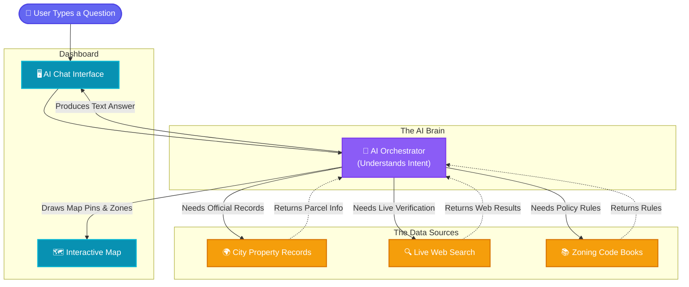

# 🏙️ The Montgomery City Planner: Project Overview

The **Montgomery City Planner** is an AI-powered "urban analyst" designed to help city officials, real estate developers, and local businesses make smarter, faster decisions. By combining natural language understanding (speaking to it like a human) with real-world city data and interactive maps, it transforms complex urban data into clear, actionable insights.

---

## 🎯 What Does It Do? (Key Features)

Here are the main problems the City Planner solves:

1. **🕵️ Ghost Business Detection**
   - **The Problem:** Many properties sitting empty are still registered as active businesses on city books, hiding potential tax liabilities or opportunities.
   - **The Solution:** The AI checks official city parcel records and automatically cross-references them with live web searches. If a business has an official record but no live website or Google presence, it flags it as a "Ghost Business" with a red marker on the map.

2. **🍔 Retail Gap & Market Demand**
   - **The Problem:** Identifying where a new grocery store, coffee shop, or pharmacy is needed most requires combining zoning data, property availability, and market demand.
   - **The Solution:** The AI finds the distance between existing services and vacant lots, highlighting "retail deserts" and recommending the optimal locations to build new amenities.

3. **💸 "Money Pit" Liability Tracking**
   - **The Solution:** It overlaps property maintenance costs (like 311 calls for illegal dumping or structural issues) with parcel values, pinpointing expensive, neglected properties that drain city resources.

4. **📈 "Future-MGM" 2026 Zoning Simulator**
   - **The Solution:** It allows planners to toggle between current (1985) zoning rules and the new 2026 Comprehensive Plan. It simulates the future financial impact—such as a 20% revenue lift—and highlights the affected neighborhoods.

5. **📜 Instant Policy Expert**
   - **The Solution:** Instead of reading through hundreds of pages of legal zoning codes, a user can just ask the AI, "What is the maximum building height for downtown?" and get a direct, cited answer.

---

## 🛤️ How It Works (The Workflow)

When a user asks a question, a step-by-step process happens behind the scenes:

1. **User Asks**: A natural language question is typed into the dashboard.
2. **AI Brain Listens**: The "LangGraph Agent" (our AI brain) figures out what data it needs to answer the question.
3. **Data Retrieval**: It reaches out to various data sources (like the official property records or a live web search).
4. **Analysis**: The AI processes the data, performs the logic (e.g., matching property owners to live search results).
5. **Presentation**: It formats the final answer in plain English, generates data charts, and updates the interactive map.

Here is a visual diagram of that workflow:

---

## 🗄️ What Data Are We Using?

The system relies on four main types of data to make its decisions:

1. **ArcGIS City Data**: The official Montgomery municipal database. This provides the ground truth for who owns a piece of land, its exact location (GPS coordinates), and its assessed financial value.
2. **Live Web Search (Bright Data API)**: A tool that performs Google searches strictly to verify if a business actively exists in the real world.
3. **Legal Documents (ChromaDB)**: The actual PDF files of Montgomery's 2020 Comprehensive Plan and the new Zoning Ordinances. The AI "reads" these so it can answer legal and policy questions accurately.
4. **Mock/Simulated Data**: To demonstrate advanced capabilities like tracking 311 maintenance requests, school safety zones, or 15-minute walkability, the system uses realistic, generated data layers placed over the real city geography.

---

## 🧠 The Logic: A Simple Example

Here is a plain-English look at how the AI solves a **"Ghost Business"** query:

* **Step 1:** The user says, "Find ghost businesses in downtown."
* **Step 2:** The AI queries the official city database (ArcGIS) for all businesses registered in the 'Downtown' area and gets a list of 15 registered property owners.
* **Step 3:** For each of those 15 names, the AI runs a live Google search.
* **Step 4:** It compares the results. If "Montgomery Hotels LLC" is on the city's books, but the live web search says "No results found," the AI concludes it is a Ghost Business.
* **Step 5:** The AI tells the user what it found, creates a table showing the lost tax value, and drops red pins on the map at the exact locations of those ghost properties.
